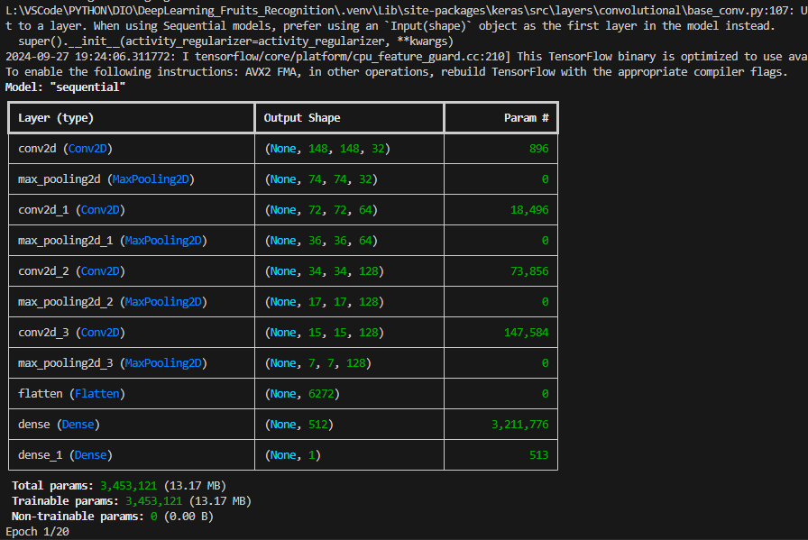

# Reconhecimento de Frutos Verdes e Maduros com Deep Learning

## Objetivo

O objetivo deste projeto é desenvolver e otimizar uma rede neural convolucional (CNN) para classificar imagens de frutos verdes e maduros. O projeto utiliza um conjunto de dados de frutas e implementa técnicas de aprendizado profundo para treinar um modelo que possa reconhecer e diferenciar o estado de maturação das frutas.

As imagens usadas para o treinamento foram obtidas do dataset "Fruits-360", disponível em: [Kaggle - Fruits-360](https://www.kaggle.com/datasets/moltean/fruits?resource=download).

## Estrutura de Pastas

    DeepLearning_Fruits_Recognition/
    │
    ├── data/                       # Diretório com as imagens de treino e validação
    │   ├── train/                  # Conjunto de treino
    │   │   ├── green_fruits/       # Imagens de frutas verdes para treino
    │   │   └── ripe_fruits/        # Imagens de frutas maduras para treino
    │   └── validation/             # Conjunto de validação
    │       ├── green_fruits/       # Imagens de frutas verdes para validação
    │       └── ripe_fruits/        # Imagens de frutas maduras para validação
    │
    |__ images_projeto/
    |
    |__ models/
    |
    ├── notebooks/                  # Contém o código principal do projeto
    │   └── fruit_classification.py # Código de treinamento do modelo
    │
    ├── results/                    # Resultados obtidos durante o treinamento
    │   └── process_images/         # Imagens geradas (gráficos, amostras de treino)
    │       ├── sample_training_images.png       # Amostra de imagens de treino
    │       └── training_validation_metrics.png  # Gráficos de acurácia e perda
    │
    |__ utils
    |
    ├── .venv/                      # Ambiente virtual Python
    |__ .gitignore
    ├── README.md                   # Documento explicativo do projeto
    └── requirements.txt            # Lista de bibliotecas necessárias
    |__ parecer_tecnico.pdf

## Tecnologias Utilizadas

- Python 3.12
- TensorFlow 2.16.1 para criação e treinamento da rede neural convolucional.
- Matplotlib para visualização dos resultados de treinamento.
- NumPy para manipulação de arrays e processamento de dados.
- Kaggle Fruits-360 Dataset como base de dados de imagens de frutas.

## Bibliotecas Utilizadas

As seguintes bibliotecas foram instaladas e utilizadas no projeto:

- tensorflow
- matplotlib
- numpy
- pillow

Para instalar as dependências, use o seguinte comando:

    pip install -r requirements.txt

## Comandos Executados Durante o Processo

1. Criar e ativar o ambiente virtual:
    python -m venv .venv
    .venv\Scripts\activate

2. Instalar as dependências necessárias:
    pip install -r requirements.txt

3. Executar o script de treinamento:
    python notebooks/fruit_classification.py

## Imagens do Processo de Desenvolvimento

Aqui estão as imagens que documentam o processo de desenvolvimento:

- **Ambiente Virtual Configurado**:
  

- **Bibliotecas Instaladas**:
  

- **Execução do Script de Treinamento**:
  

- **Requisitos do Projeto**:
  

- **TensorFlow Instalado**:
  

- **Teste de Sucesso no Começo**:
  

- **Teste de Sucesso Durante o Treinamento**:
  

- **Teste de Sucesso Final**:
  

## Análise Final

O modelo foi treinado utilizando 782 imagens no total, divididas entre frutas verdes e maduras. A acurácia final de validação alcançada foi de aproximadamente 73,5%, enquanto a perda de validação aumentou ao longo das épocas, indicando sinais de overfitting. O modelo precisa de melhorias para generalizar melhor os resultados, tais como aumentar o conjunto de dados e aplicar técnicas de data augmentation.

- **Imagem das frutas**:
  

- **Gráfico de Acurácia e Perda**:
  

## Recomendações

- Data Augmentation: Para melhorar a generalização, aplicar transformações como rotação, inversão e zoom nas imagens durante o treinamento pode ajudar a reduzir o overfitting.
- Ajuste de Hiperparâmetros: Tentar diferentes valores para a taxa de aprendizado e número de épocas também pode melhorar o desempenho.
- Aumento do Dataset: Adicionar mais imagens ao conjunto de treino, especialmente imagens de frutas em diferentes condições de luz e ambiente, pode ajudar o modelo a aprender mais variabilidades.

## Licença

Este projeto é licenciado sob a Licença Apache 2.0 - consulte o arquivo LICENSE para mais detalhes.
Autor

## Desenvolvido por [Seu Nome]

Izairton O de Vasconcelos
<https://github.com/IOVASCON/IoT_Redes_Neurais_Artificiais.git>
